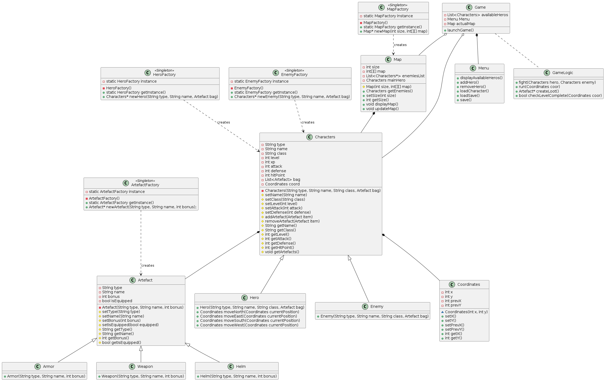

# Swingy
**Swingy** is a small Java RPG built following the **MVC pattern**.  
Players can create a hero, explore a map, fight random enemies, and gain experience to level up.
The game supports both **console mode** and **GUI mode (Swing)**, and is built using **Maven**.

---

## 📜 Table of Contents

- [Features](#features)  
- [Architecture & Technologies](#architecture--technologies)  
- [Installation & Execution](#installation--execution)  
- [Usage](#usage)  
- [Rules](#Rules)
- [Project Structure](#project-structure)  
- [UML Diagram](#uml-diagram)  
- [Example](#example)  

---

## ⚔️ Features

- Create a hero (name, class, initial stats)  
- Randomly generated map  
- Random enemy encounters  
- Combat and flee mechanics  
- Experience gain and leveling system  
- Two modes available:
  - **Console mode** — text-based gameplay  
  - **GUI mode (Swing)** — graphical interface with buttons and map display  
- Full **MVC architecture** separation (Model–View–Controller)  
- Built and packaged using **Maven**

---

## 🧠 Architecture & Technologies

- **Language:** Java  
- **GUI Framework:** Swing  
- **Build Tool:** Maven  
- **Architecture Pattern:** MVC  
- **Core Systems:**  
  - Map generation  
  - Combat logic  
  - XP and level-up system  
  - Save/load mechanics  

---

## ⚙️ Installation & Execution

### Prerequisites
- Java 8 or higher
- Maven installed

### Clone the Repository
```bash
git clone https://github.com/cypri1-dev/swingy.git
cd swingy/swingy
```

### Build the project
```bash
mvn clean package
```
This will generate a .jar file in the target/ directory.

### Run in Console Mode
```bash
java -jar target/swingy-<version>.jar console
```

### Run in GUI Mode(Swing)
```bash
java -jar target/swingy-<version>.jar gui
```

---

## 🕹️ Usage

1.Launch the game (console or GUI).
2.Create a new hero or load an existing one.
3.Move around the map grid using the available controls.
4.Encounter random enemies.
5.Choose to fight or run away.
6.Gain experience after winning battles.
7.Level up and improve your hero’s stats (attack, defense, HP, etc.).
8.Continue exploring until your hero wins or perishes!

---

## 🏰 Rules

🧙‍♂️ 1. HEROES & PLAYER

  1.1 Creation and Selection
- The player can own **multiple heroes** of different types.  
- At the start of the game, two options are available:  
  1. **Create a hero**  
  2. **Select an existing hero**  
- Each hero is **named by the player**.

  1.2 Classes and Base Stats
Each hero type (class) has its own starting stats:
- **Hero name**  
- **Class**  
- **Level**  
- **Experience**  
- **Attack**  
- **Defense**  
- **Hit Points (HP)**  

Stats are influenced by:
- The hero’s **level**  
- The **artifacts** equipped (weapons, armor, helmets)

---

⚔️ 2. ARTIFACTS & ITEMS

  2.1 Types of Artifacts
There are **3 main artifact categories**:
- 🗡️ **Weapon** → increases attack  
- 🛡️ **Armor** → increases defense  
- 🪖 **Helmet** → increases hit points  

  2.2 Rarity Levels
Each artifact or item can be:
- **Common**  
- **Rare**  
- **Epic**  
- **Legendary**

> 💎 There are **75 different artifacts** in total.

  2.3 Potions
- **Potions** restore hit points during or outside combat.  
- They can be found randomly on enemies or on the map.

---

🧭 3. MAP & MOVEMENT

  3.1 Map Size
The map is **square** and its size depends on the hero’s level:
\[
\text{Size} = (\text{Level} - 1) \times 5 + 10 - (\text{Level} \bmod 2)
\]

> Example: a level 7 hero → a **39x39 grid**

  3.2 Starting Position and Objective
- The hero starts **in the center** of the map.  
- The goal is to **reach any edge** of the map to win.

  3.3 Possible Moves
The hero can move one tile per turn in one of four directions:
- North  
- East  
- South  
- West  

  3.4 Enemies
- The map contains **20 monsters** placed **randomly**.  
- Their power varies depending on their level and rarity.

---

💀 4. COMBAT

  4.1 Triggering Combat
- When the hero moves onto a tile occupied by an enemy, they must choose between:
  1. **Fight**  
  2. **Try to run**

  4.2 Combat Options
Combat has **4 main actions**:

1. ⚔️ **Fight**  
   - Both sides roll dice.  
   - The higher roll hits the opponent.  
   - The defender’s **defense is halved** in this mode.

2. 🛡️ **Block**  
   - The hero takes a defensive stance.  
   - They receive **a guaranteed hit**, but with **full defense** applied.

3. 🏃 **Run**  
   - The hero has a **50% chance** to escape back to the previous tile.  
   - On failure, they take **a guaranteed hit**.

4. 💊 **Use Potion**  
   - The hero uses a potion to restore HP.  
   - This consumes the turn.

  4.3 Combat Outcome
- If the hero **loses**, they **die permanently** and are **deleted** from the game.  
- If the hero **wins**:
  - They gain **experience points** based on enemy power.  
  - They may receive a **random artifact** (loot is not guaranteed; quality varies).  
  - They **level up** if experience meets the next level threshold.

  4.4 Experience Calculation
Level progression formula:
\[
\text{XP required} = \text{Level} \times 1000 + (\text{Level} - 1)^2 \times 450
\]

| Level | XP Needed |
|-------|-----------|
| 1     | 1,000     |
| 2     | 2,450     |
| 3     | 4,800     |
| 4     | 8,050     |
| 5     | 12,200    |

---

🎒 5. INVENTORY

Inventory supports these actions:
- **Equip** an artifact or item  
- **Unequip** an artifact  
- **Drop** an item  
- **Use Potion** to recover HP  

---

📚 6. KNOWLEDGE & SAVE SYSTEM

  6.1 Knowledge Sharing
- All **knowledge gained is shared across all heroes** of the player.

  6.2 Saving
- The game **auto-saves upon proper exit**.  
- Manual modification of save files leads to **automatic deletion of the affected hero** (anti-cheat measure).

---

🪦 7. DEATH & REMOVAL

- Death in combat results in **permanent hero deletion**.  
- Resurrection or recovery from altered saves is impossible.

---

🎲 8. RANDOM ELEMENTS

- **Enemy placement** is randomly generated each game.  
- **Loot drops** are probabilistic, depending on the enemy and rarity.  
- **Combat outcomes** are influenced by dice rolls and luck.


## 📁 Project Structure

```bash
swingy/
├── src/
│   ├── main/
│   │   ├── java/
│   │   │   ├── model/        ← Game entities (Hero, Enemy, Map, etc.)
│   │   │   ├── view/         ← Views (ConsoleView, GUIView)
│   │   │   ├── controller/   ← Game controllers and logic
│   │   └── resources/        ← Assets and config files
├── target/                   ← Build output
├── pom.xml                   ← Maven configuration
└── README.md                 ← Project documentation
```
The project strictly follows MVC conventions for clean code separation and scalability.

---

## UML Diagrams

UML diagrams illustrate the class structure and interactions, showing the system architecture and relationships between entities. The diagram is flexible and can evolve as the design changes, allowing adjustments to reflect new requirements or improvements in the system.



## Example

