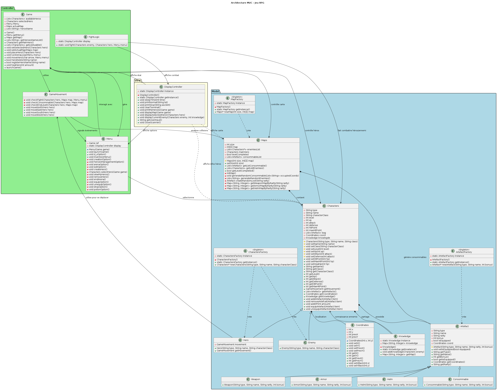

# Swingy
**Swingy** is a small Java RPG built following the **MVC pattern**.  
Players can create a hero, explore a map, fight random enemies, and gain experience to level up.
The game supports both **console mode** and **GUI mode (Swing)**, and is built using **Maven**.

---

## 📜 Table of Contents

- [Features](#features)  
- [Architecture & Technologies](#architecture--technologies)  
- [Installation & Execution](#installation--execution)  
- [Usage](#usage)  
- [Project Structure](#project-structure)  
- [UML Diagram](#uml-diagram)  
- [Example](#example)  

---

## ⚔️ Features

- Create a hero (name, class, initial stats)  
- Randomly generated map  
- Random enemy encounters  
- Combat and flee mechanics  
- Experience gain and leveling system  
- Two modes available:
  - **Console mode** — text-based gameplay  
  - **GUI mode (Swing)** — graphical interface with buttons and map display  
- Full **MVC architecture** separation (Model–View–Controller)  
- Built and packaged using **Maven**

---

## 🧠 Architecture & Technologies

- **Language:** Java  
- **GUI Framework:** Swing  
- **Build Tool:** Maven  
- **Architecture Pattern:** MVC  
- **Core Systems:**  
  - Map generation  
  - Combat logic  
  - XP and level-up system  
  - Save/load mechanics  

---

## ⚙️ Installation & Execution

### Prerequisites
- Java 8 or higher
- Maven installed

### Clone the Repository
```bash
git clone https://github.com/cypri1-dev/swingy.git
cd swingy/swingy
```

### Build the project
```bash
mvn clean package
```
This will generate a .jar file in the target/ directory.

### Run in Console Mode
```bash
java -jar target/swingy-<version>.jar console
```

### Run in GUI Mode(Swing)
```bash
java -jar target/swingy-<version>.jar gui
```

---

## 🕹️ Usage

1.Launch the game (console or GUI).
2.Create a new hero or load an existing one.
3.Move around the map grid using the available controls.
4.Encounter random enemies.
5.Choose to fight or run away.
6.Gain experience after winning battles.
7.Level up and improve your hero’s stats (attack, defense, HP, etc.).
8.Continue exploring until your hero wins or perishes!

---

## 📁 Project Structure

```bash
swingy/
├── src/
│   ├── main/
│   │   ├── java/
│   │   │   ├── model/        ← Game entities (Hero, Enemy, Map, etc.)
│   │   │   ├── view/         ← Views (ConsoleView, GUIView)
│   │   │   ├── controller/   ← Game controllers and logic
│   │   └── resources/        ← Assets and config files
├── target/                   ← Build output
├── pom.xml                   ← Maven configuration
└── README.md                 ← Project documentation
```
The project strictly follows MVC conventions for clean code separation and scalability.

---

## UML Diagrams

UML diagrams illustrate the class structure and interactions, showing the system architecture and relationships between entities. The diagram is flexible and can evolve as the design changes, allowing adjustments to reflect new requirements or improvements in the system.



## Example

